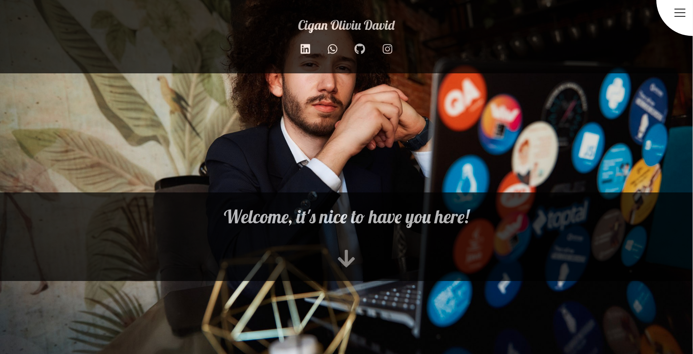
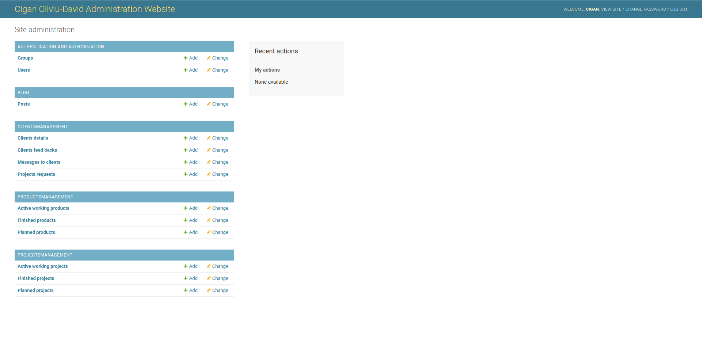
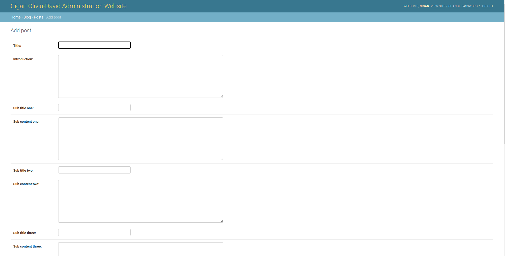
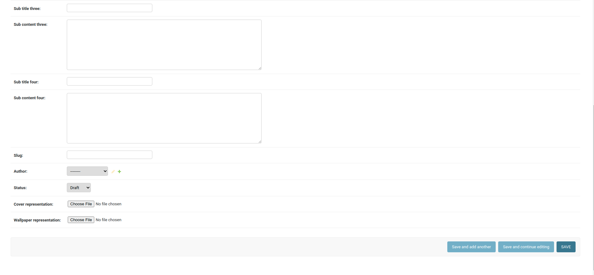
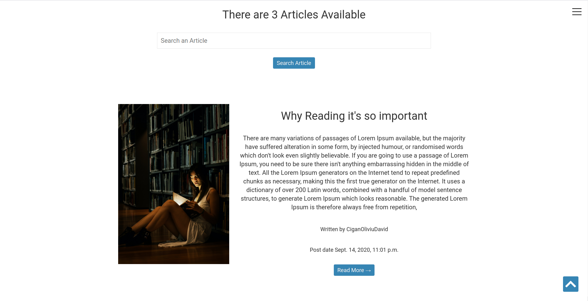

# ciganoliviudavid.com

This app represents my personal website which includes a set of backend
as well as frontend functionalities.

## Backend

In the backend I have a blog system as well as a CRM (Clients 
Relationship Management), both of them are administrated from a control panel. 
The control panel requires authentication from a superuser which is created for a client in the 
development process or later in the maintenance process.

#### The databases and tables can be seen below

##### AUTHENTICATION AND AUTHORIZATION

This database includes the Users or better said the clients which you communicate with through the 
CRM, it is auto-generated by the django web framework and reconfigured to be appliable to the system.  

##### BLOG

The Posts table from the Blog Database includes all the articles which can be seen in the platform
at the personal blog section. From this part of the administration system you can actualise, 
change or write articles very easy through a basic form.

##### Checking the articles from the blog system

 

##### Adding a new article

 

 

##### The way it looks in the UI

 
